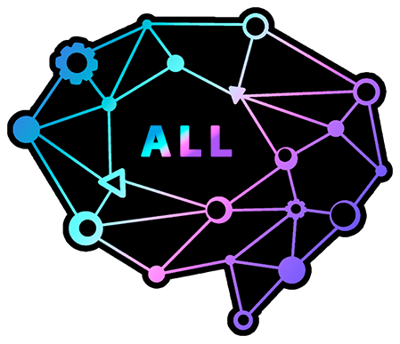

<p align="center">
  <a href="https://all-ai-network.org">
    
  </a>
</p>

<h1 align="center">ALL Applied AI Network — Hub Template</h1>

<p align="center">
  <strong>Fork this repo. Edit one file. Your chapter website is live.</strong>
</p>

<p align="center">
  <a href="https://all-applied-ai-network.github.io/aain-hub-template/">Demo</a> ·
  <a href="#quick-start">Quick Start</a> ·
  <a href="#customization">Customization</a> ·
  <a href="https://github.com/ALL-Applied-AI-Network/aain-content">Content Library</a>
</p>

<p align="center">
  <a href="https://github.com/ALL-Applied-AI-Network/aain-hub-template/actions/workflows/pages.yml"></a>
  <a href="LICENSE.md"></a>
</p>

---

This is the website template for chapters in the **ALL Applied AI Network**. It gives every university AI club a professional website that automatically pulls curriculum, workshops, and playbooks from the [shared content library](https://github.com/ALL-Applied-AI-Network/aain-content).

**[See the live demo &rarr;](https://all-applied-ai-network.github.io/aain-hub-template/)**

## Quick Start

### Option 1: Start a new chapter website

1. Click **[Use this template](https://github.com/ALL-Applied-AI-Network/aain-hub-template/generate)** (green button, top right)
2. Name your repo (e.g., `msoe-ai-club`)
3. Edit **`hub.config.json`** with your chapter details (see [Customization](#customization) for all options)
4. Enable GitHub Pages in your repo settings (Settings > Pages > Source: GitHub Actions)
5. Push — your site deploys automatically

Your site is now live at `https://{your-username}.github.io/{repo-name}/`.

### Option 2: Custom subdomain (e.g., `msoe.all-ai-network.org`)

Want your site at a subdomain on the ALL network domain? After completing the steps above:

1. Contact the ALL network team to request a subdomain
2. We add a DNS record pointing `{your-hub}.all-ai-network.org` to your GitHub Pages site
3. Add your subdomain to your repo's Pages settings (Settings > Pages > Custom domain)

That's it — GitHub handles HTTPS automatically.

### Option 3: Hook into an existing website

If your chapter already has a website and you just want the content, fetch directly from the content library:

```typescript
const CONTENT = 'https://all-ai-network.org';

// Get the full learning tree (nodes, edges, prerequisites)
const tree = await fetch(`${CONTENT}/tree.json`).then(r => r.json());

// Get a content manifest (all playbooks, workshops, learning nodes)
const manifest = await fetch(`${CONTENT}/manifest.json`).then(r => r.json());

// Fetch a specific article as markdown
const article = await fetch(`${CONTENT}/learning/foundations/what-is-ai/what-is-ai.md`).then(r => r.text());
```

The content library is a static JSON + Markdown API — no authentication, no SDK, no dependencies. Fetch and render however you want.

## What you get

- **Learning tree** — Shared curriculum rendered inline on your site. Starts at absolute zero, builds to shipping AI products.
- **Workshops** — Hands-on session content with facilitator guides. Ready to run at your next meeting.
- **Playbooks** — Operational guides for running a hub: getting started, sponsors, hackathons, speaker series, research groups.
- **Events** — List your club's upcoming events, meetings, and hackathons right in the config.
- **Officers** — Showcase your leadership team with names, roles, and optional photos.
- **Custom about** — Write your club's story in the config — no HTML editing required.
- **Auto-deploy** — Push to `main` and GitHub Pages deploys. No CI config needed.
- **Theming** — Set two colors in the config and the entire site adapts.
- **Inline content** — Articles render on your site, not on a separate domain. Students stay on your hub.

Content updates happen upstream in [`aain-content`](https://github.com/ALL-Applied-AI-Network/aain-content). Your hub fetches it at runtime — when the network adds a new learning node or workshop, every hub gets it automatically.

## Dashboard integrations

Every hub can pull live data from the ALL Applied AI Network dashboard (events, leaderboard, chapter stats) using an API key. The canonical list of available integrations lives in **[`public/integrations.json`](./public/integrations.json)** — it describes every supported endpoint with code snippets, response shapes, and agent prompts.

This file is the single source of truth:
- The **hub template** itself uses these definitions to render live widgets.
- The **dashboard** (`dashboard.all-ai-network.org/website`) fetches this file and surfaces the same snippets to every hub.

To add a new integration, edit `integrations.json` here. Both surfaces update on the next deploy.

## Dashboard-controlled config (theme, logo, sections)

**Anything your eboard might want to change without opening this repo is controlled from the dashboard's Website → Customize tab, not `hub.config.json`.** The hub-template fetches this config at every page load from a public, no-auth endpoint:

```
GET https://dashboard.all-ai-network.org/api/public/config/{hub_id}
```

where `{hub_id}` matches `hub_id` in `hub.config.json` (also your chapter slug on the dashboard). Response:

```json
{
  "config": {
    "theme":    { "primary": "#4f8fea", "accent": "#a855f7" },
    "logo_url": "https://.../logo.png" | null,
    "sections": { "hero": true, "events": true, "leaderboard": true, ... },
    "updated_at": "2026-04-19T19:14:02.000Z"
  }
}
```

[`src/main.ts`](src/main.ts) applies the response on load:
- **Theme** → sets `--color-primary`, `--color-accent`, `--color-primary-rgb` on `:root` so the whole site recolors without a rebuild.
- **Logo** → swaps the `#nav-logo-img` element in for the text acronym when `logo_url` is non-null.
- **Sections** → any section toggled off is **removed from the DOM entirely** (not just hidden) along with its nav link, so layouts don't end up with visual gaps.

**Fallback behavior:** if the fetch fails (dashboard unreachable, CORS hiccup, no chapter row yet), the page falls back to the bundled `hub.config.json` — the site always renders.

**For AI agents maintaining a forked hub site:** don't duplicate these values into `hub.config.json` — they're the dashboard's responsibility. The local config is the offline / first-deploy fallback only. If you need to add a new section that should be togglable from the dashboard, add its key to `KNOWN_SECTIONS` in `aain-api/src/lib/hub-config.ts` and to the `SECTION_MAP` in `src/main.ts::applyRemoteSections`.

### Preview mode

The template accepts `?preview=1` query params so the dashboard's Customize tab can iframe it and show the eboard a live preview of their in-progress edits before they save. In preview mode we skip the remote fetch and apply overrides from the URL instead.

| Param | Purpose |
| --- | --- |
| `preview=1` | Required. Enables preview mode. |
| `primary` | Primary color (URL-encoded hex). |
| `accent` | Accent color (URL-encoded hex). |
| `logo` | Full URL to a custom logo. Empty string = explicitly clear; missing = use default. |
| `off` | Comma-separated list of disabled section keys, e.g. `events,merch`. |

Example:

```
https://all-applied-ai-network.github.io/aain-hub-template/?preview=1&primary=%234f8fea&accent=%23a855f7&off=events,merch
```

When adding new URL-driven overrides, handle them in [`applyPreviewFromParams`](src/main.ts) and document them here so the dashboard's preview builder stays in sync.

## Customization

Everything is driven by `hub.config.json`. Here's the full config with all options:

```json
{
  "hub_name": "MSOE AI Club",
  "hub_acronym": "MAIC",
  "hub_id": "msoe-ai-club",
  "university": "Milwaukee School of Engineering",
  "description": "Building the next generation of applied AI engineers.",
  "about": "Your club's story goes here. This text appears in the About section.\n\nUse \\n for paragraph breaks. No HTML needed.",
  "theme": {
    "primary_color": "#B1003E",
    "accent_color": "#06b6d4"
  },
  "links": {
    "discord": "https://discord.gg/your-server",
    "github": "https://github.com/your-org",
    "instagram": "",
    "linkedin": "",
    "email": "ai-club@msoe.edu"
  },
  "officers": [
    { "name": "Alex Johnson", "role": "President", "image": "" },
    { "name": "Sam Rivera", "role": "VP of Engineering", "image": "" }
  ],
  "events": [
    {
      "title": "Weekly Meeting",
      "date": "Every Thursday",
      "time": "7:00 PM",
      "location": "Room 201, Engineering Hall",
      "description": "Hands-on workshop and project time."
    }
  ],
  "features": {
    "learning_tree": true,
    "playbooks": true,
    "workshops": true
  },
  "content": {
    "exclude_paths": ["advanced/research-papers"],
    "custom_order": ["learning/foundations/what-is-ai/what-is-ai.md", "learning/foundations/python-setup/python-setup.md"],
    "local_content": [
      {
        "title": "Fall 2025 Innovation Labs Recap",
        "description": "Project highlights from our first Innovation Labs event.",
        "path": "local/innovation-labs-fall-2025.md",
        "type": "local",
        "section": "learning",
        "thumbnail": ""
      }
    ]
  },
  "content_url": "https://all-ai-network.org"
}
```

### Branding

| Field | What it does |
|---|---|
| `hub_name` | Full name — used in hero, page title, nav |
| `hub_acronym` | Short name — gradient wordmark in the nav bar |
| `description` | One-liner shown below the title in the hero |
| `about` | Your club's story (About section). Use `\n` for paragraph breaks. |

### Theming

Set `primary_color` and `accent_color`. These drive the hero gradient, nav wordmark, buttons, card hover effects, and accents across the entire site. Choose your university's brand colors.

### Events

Add upcoming events as an array. Each event shows a date card, title, location, and description. Remove the array or leave it empty to hide the Events section entirely.

### Officers

Add your leadership team. Each officer gets an avatar (initials if no image provided), name, and role. Remove the array to hide the Leadership section.

### Features

Toggle content sections on or off:

```json
"features": {
  "learning_tree": true,
  "playbooks": true,
  "workshops": false
}
```

Disabled sections and their nav links are hidden entirely.

### Content Customization

The `content` block lets you curate what your hub shows — exclude content that's not relevant to your chapter, set a custom learning order, and add your own local articles.

#### Exclude content

Remove specific paths from the shared content library. Useful for hiding advanced topics your club hasn't reached yet, or content that doesn't fit your focus:

```json
"exclude_paths": ["advanced/research-papers", "learning/specialized/robotics"]
```

Paths match exactly or as prefixes — `"advanced"` excludes everything under the `advanced/` folder.

#### Custom ordering

Control the order content appears on your site instead of the default alphabetical sort:

```json
"custom_order": [
  "learning/foundations/what-is-ai/what-is-ai.md",
  "learning/foundations/python-setup/python-setup.md"
]
```

Items listed here appear first, in the order specified. Everything else follows alphabetically after.

#### Local content

Add your own markdown articles — event recaps, project write-ups, sponsor spotlights, announcements — that live in your hub repo, not the shared content library:

```json
"local_content": [
  {
    "title": "Fall 2025 Innovation Labs Recap",
    "description": "Project highlights and outcomes from our first Innovation Labs event.",
    "path": "local/innovation-labs-fall-2025.md",
    "type": "local",
    "section": "learning",
    "thumbnail": ""
  }
]
```

| Field | What it does |
|---|---|
| `title` | Card title on the home page |
| `description` | Card description text |
| `path` | Path to your `.md` file relative to the repo root (must be in `local/`) |
| `section` | Where the card appears: `"learning"`, `"workshops"`, or `"playbooks"` |
| `thumbnail` | Optional image path (relative to repo root) |

Local content cards are tagged with a **Chapter** badge so students can distinguish hub-specific content from the shared curriculum. Drop your `.md` files in the `local/` folder and reference them in the config.

### Social links

Fill in what you have, leave the rest empty. Only links with URLs appear on the site.

## Development

```bash
npm install
npm run dev       # Local dev server with hot reload
npm run build     # Production build to dist/
npm run preview   # Preview production build
```

## Project Structure

```
hub.config.json          Your chapter identity, theme, content curation, and feature flags
index.html               Home page
article.html             Inline content viewer (learning articles, workshops, playbooks)
local/                   Your chapter's own markdown content (event recaps, projects, etc.)
src/
├── main.ts              Home page: config, content fetching, filtering, rendering
├── article.ts           Article page: markdown rendering with custom directives
└── styles/
    ├── hub.css          Home page styles (themed by config)
    └── article.css      Article content styles (callouts, code blocks, tabs, etc.)
.github/
└── workflows/
    └── pages.yml        GitHub Pages auto-deploy on push to main
```

## Tech Stack

| Layer | Technology |
|---|---|
| Build | Vite |
| Language | TypeScript |
| Markdown | marked + DOMPurify (with custom directive support) |
| Styling | Vanilla CSS (no framework dependencies) |
| Content | Fetched at runtime from [`aain-content`](https://github.com/ALL-Applied-AI-Network/aain-content) GitHub Pages |
| Deployment | GitHub Pages (via GitHub Actions) |

---

<p align="center">
  Part of the <a href="https://github.com/ALL-Applied-AI-Network">ALL Applied AI Network</a> — open-source curriculum, free forever.
</p>

<p align="center">
  <sub>&copy; 2026 ALL Applied AI Network LLC. All rights reserved.</sub><br />
  <sub>ALL Applied AI Network&trade; and the ALL logo are trademarks of ALL Applied AI Network LLC.</sub>
</p>
